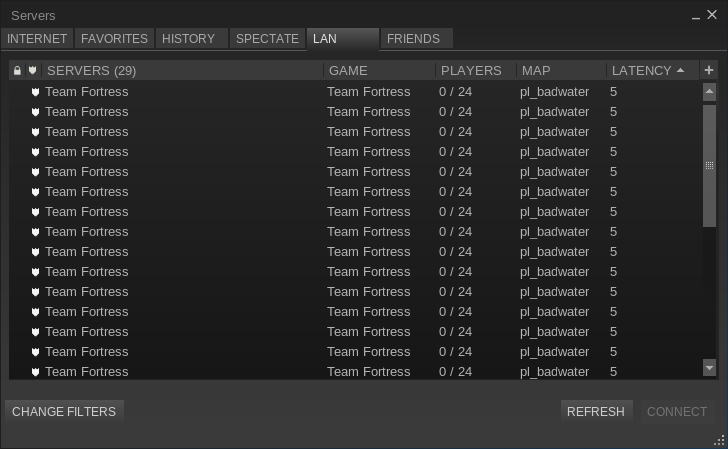
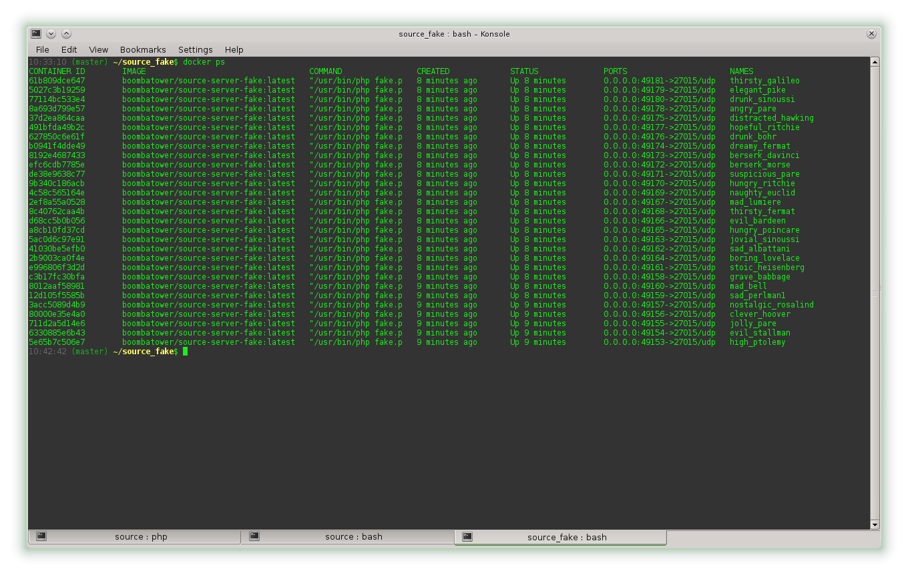
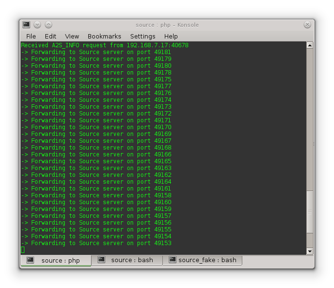

boombatower/source-broadcast-proxy
==================================
Forwards Valve's Source Engine LAN broadcast packets to non-default ports.

By proxying the broadcast packets more than the default 5 Source servers can be hosted on the same
machine/IP while still being displayed in the LAN server browser. Great for LAN parties with
powerful servers (such as large organized ones).

This implementation is designed to work with Source servers hosted in Docker containers that expose
one of the default 5 ports. No configuration is necessary as the proxy will detect running
containers and scan the exposed ports to determine which are potential Source servers.

Docker configuration
--------------------
Docker must be configured to expose its API via a TCP interface. See the relevant
[installation instructions](http://docs.docker.com/installation/) for information on configuration
location and such. It may already be configured to expose the API and there is no harm in just
running the proxy and see if it blows up.

For most setups something like the following should be in the configuration file in addition to
any other options.

    DOCKER_OPTS="-H tcp://127.0.0.1:2375"

If a non-default port is used it must be communicated to the proxy during startup by adding the
following to the command in the usage section (with the relevant port).

    -e DOCKER_PORT=13370

Usage
-----
In general the following command should do the trick.

``` sh
$ docker run -d --net host --restart 'on-failure' boombatower/source-broadcast-proxy
```

`-d` Detaches since there should not be any need to watch the proxy.

The reason for `--net host` is to ensure easy access to Docker API port without having to setup
forwarding rules and what not from the Docker network device to the host. It also simplifies
forwarding to the Source servers since they can be accessed directly on the host ports instead of
needing to be accessed via the Docker gateway.

`--restart 'on-failure'` does exactly what it says to ensure the proxy stays running.

Source server containers
------------------------
Either build Docker images for the Source servers you are interested in hosting and/or search for
existing images to start from. For example: Google `docker tf2`.

Since the port does not matter disregard any instructions about mapping ports using `-p`. For
example mapping the default Source port to the host `-p 27015:27015/udp`. Instead use the upper-case
`-P` to have Docker pick a free port on the host so one does not have to bother keeping track of
ports since the proxy will do so.

Fakes servers
-------------
To test a setup ahead of time it is recommended launch a bunch of lightweight fake servers using
[boombatower/source-server-fake](https://github.com/boombatower/source-server-fake).

Result
------
Host as many Source servers in Docker containers as desired and have them all show up in the LAN
server browser!






